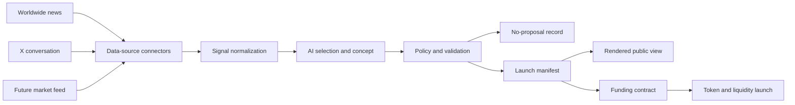

# Architecture

MemeToro separates idea generation from launch execution. The off-chain agent creates public proposals, while deterministic smart contracts enforce the published rules.

## Data sources

Dependency-free connectors collect current public signals for the agent. The initial connector queries Perplexity Sonar for broad worldwide-news coverage and xAI X Search for accelerating conversation on X. It returns structured candidates, evidence links, meme-relevance notes, and risk notes.

Connector responses are untrusted and may be incomplete, manipulated, or inaccurate. Later analysis must verify evidence, compare sources, preserve provenance, and reject unsafe or unsuitable topics. API providers and credentials are never part of the trusted launch path.

## Agent

The agent is the off-chain system that evaluates news, trends, culture, and market data, then creates meme-token proposals. The pipeline normalizes source records, asks the model to select and describe at most one candidate, and applies launch parameters from explicit policy. The model does not choose custody or execution rules and never controls contributor funds.

Two properties keep the agent honest about its own reasoning. It publishes every candidate it had available rather than only the winner, so a reader can assess the shortlist instead of accepting a conclusion. And it can decline: a window with nothing suitable produces a record explaining why, because a published shortlist means little if refusal is unreachable.

## Manifest

The launch manifest is the public, machine-readable record for a proposal. It contains the meme concept, market reasoning, risk assessment, cited evidence with its recorded context, countable source facts, the candidate selection record, token parameters, funding rules, launch conditions, and provenance. Once funding starts, its committed launch terms must not be silently changed.

The manifest stays canonical and machine-readable. Readable views are produced from it by a deterministic rendering function rather than written separately, so the page a contributor reads cannot state terms that differ from the ones the contracts would enforce.

Source facts are counts, never scores. Collection sources return no volume or engagement figures, so a strength rating would be invented, and invented precision is worse than none on a page where people decide to send funds.

## Smart contracts

Smart contracts are the deterministic system responsible for accepting funding, enforcing caps and deadlines, executing eligible launches, distributing token claims, and providing refunds when launch conditions are not met. These actions must remain available without the MemeToro backend.

## Public interface

The public interface is the website or application through which users inspect proposals and manifests, contribute to funding rounds, finalize eligible launches, claim tokens, and request refunds. It is a convenience layer rather than a trusted part of execution.

## Principles

- The agent proposes.
- The contracts execute.
- The backend is optional.
- Launch conditions are public.
- There is no insider allocation.
- Published launch terms cannot be silently changed.
- The rejected shortlist is published alongside the winner.
- Declining to propose is a valid outcome.
- Published figures are counted, not scored.
