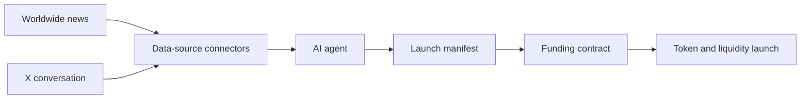

# Architecture

MemeToro separates idea generation from launch execution. The off-chain agent creates public proposals, while deterministic smart contracts enforce the published rules.

## Data sources

Dependency-free connectors collect current public signals for the agent. The initial connector queries Perplexity Sonar for broad worldwide-news coverage and xAI X Search for accelerating conversation on X. It returns structured candidates, evidence links, meme-relevance notes, and risk notes.

Connector responses are untrusted and may be incomplete, manipulated, or inaccurate. Later analysis must verify evidence, compare sources, preserve provenance, and reject unsafe or unsuitable topics. API providers and credentials are never part of the trusted launch path.

## Agent

The agent is the off-chain system that evaluates news, trends, culture, and market data, then creates meme-token proposals. It produces structured reasoning and launch parameters but never controls contributor funds.

## Manifest

The launch manifest is the public, machine-readable record for a proposal. It contains the meme concept, market reasoning, evidence sources, token parameters, funding rules, and launch conditions. Once funding starts, its committed launch terms must not be silently changed.

## Smart contracts

Smart contracts are the deterministic system responsible for accepting funding, enforcing caps and deadlines, executing eligible launches, distributing token claims, and providing refunds when launch conditions are not met. These actions must remain available without the MemeToro backend.

## Public interface

The public interface is the website or application through which users inspect proposals and manifests, contribute to funding rounds, finalize eligible launches, claim tokens, and request refunds. It is a convenience layer rather than a trusted part of execution.

## Principles

- The agent proposes.
- The contracts execute.
- The backend is optional.
- Launch conditions are public.
- There is no insider allocation.
- Published launch terms cannot be silently changed.
